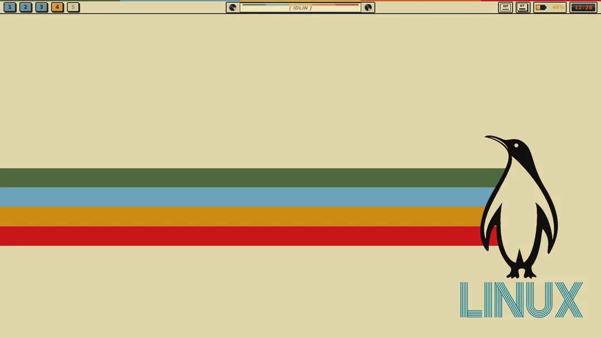
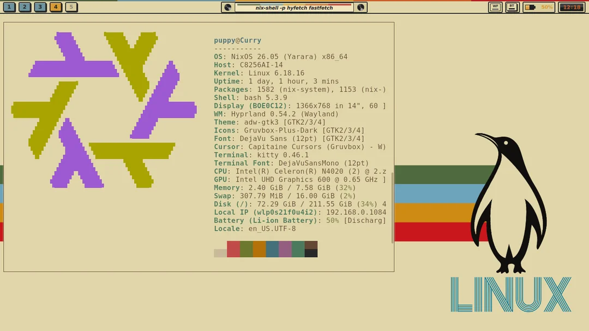
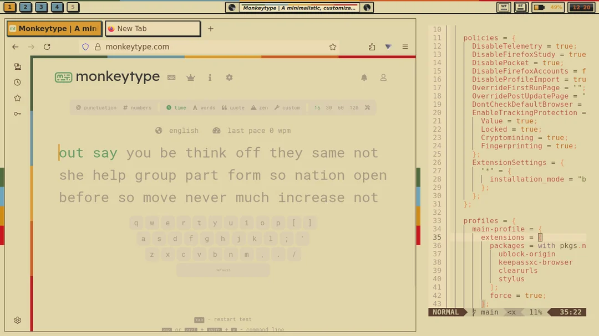
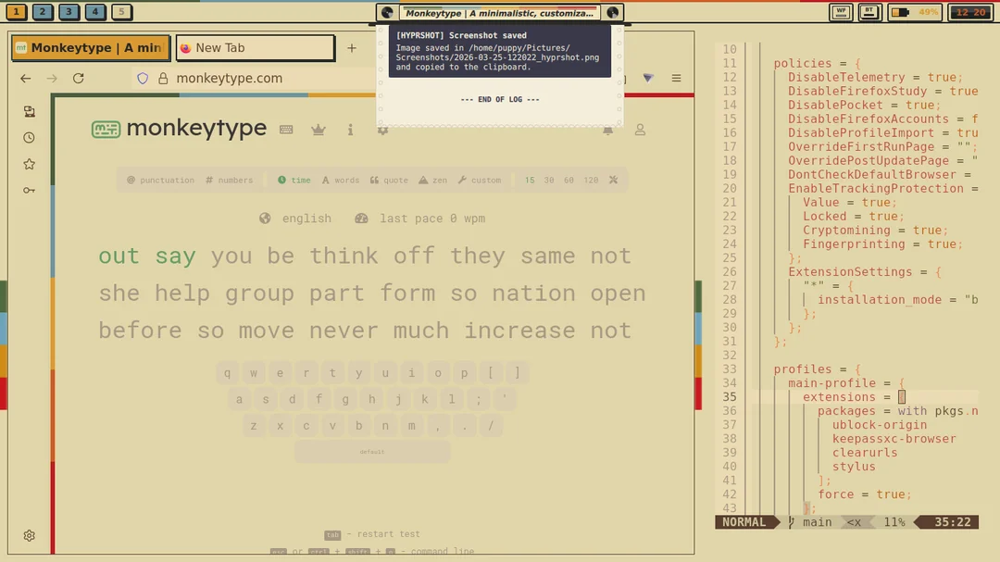
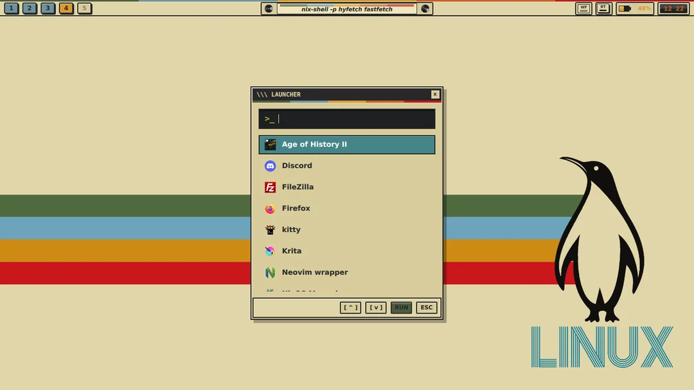
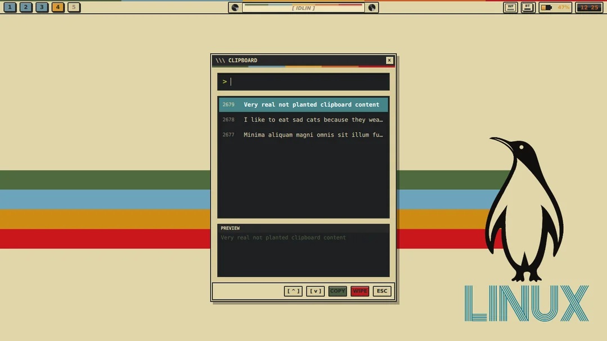

These be my personal nixos configuration files, I didnt test it much so it might break in other systems.
Btw you probably wanna remove the hardware-configuration.nix file before using it yerself

specs:
Editor: nixvim (neovim)
Browser: firefox
Terminal: Kitty
WM: Hyprland
Bar/Launcher/Clipboard/Notifications = Quickshell

Notes:
it's a WIP, the quickshell configuration isn't integrated in my files yet, so you just gotta copy it to ~/.config.
Alsoo some of the modules are kinda broken, specially the one for notifications, im still workin on it

Useful Binds:
SUPER + T = Terminal
SUPER + A = Launcher
SUPER + V = Clipboard
SUPER + B = Notification history
SUPER + N = Screenshot (Region)
SUPER + 1-0  = Change workspace
SUPER + HJKL = Change focus

Capslock is disabled, holding it activates a layer that makes J and K mimic the left and right mouse buttons respectively. (You can just disable this in configuration.nix, it's the keyd thingie)

Screenshots:

