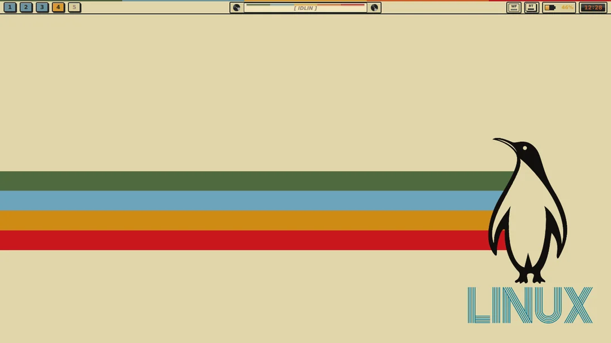
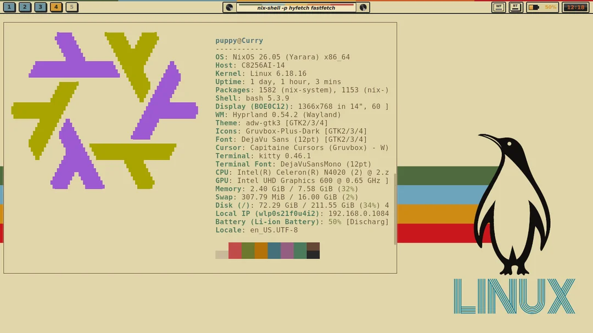
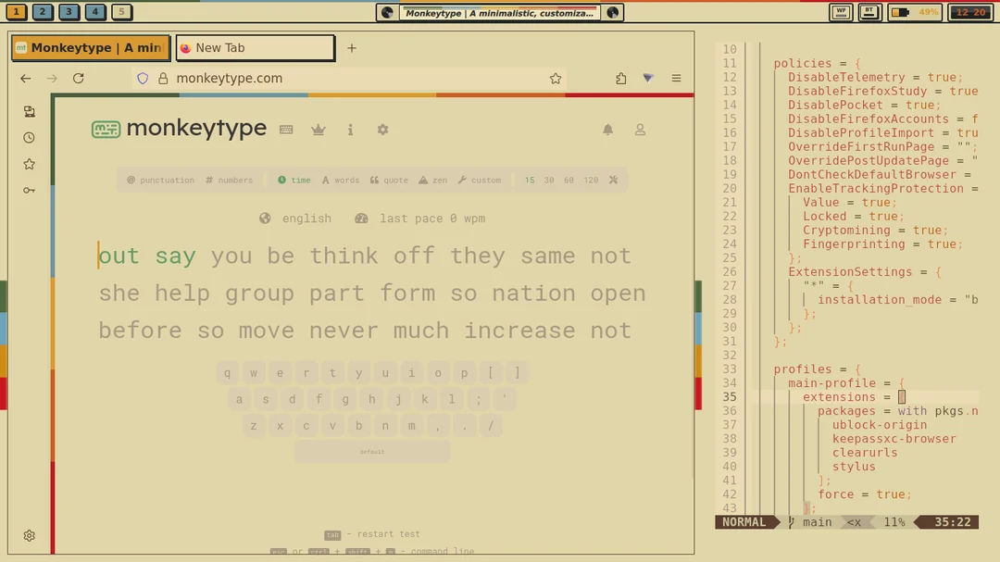
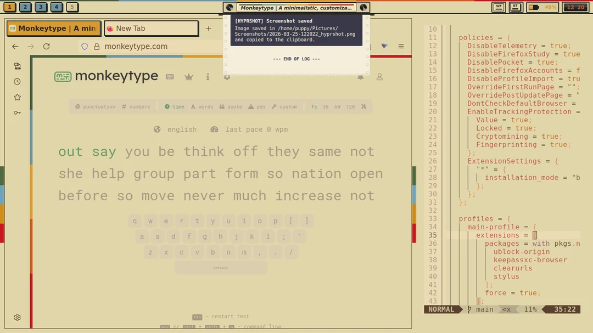
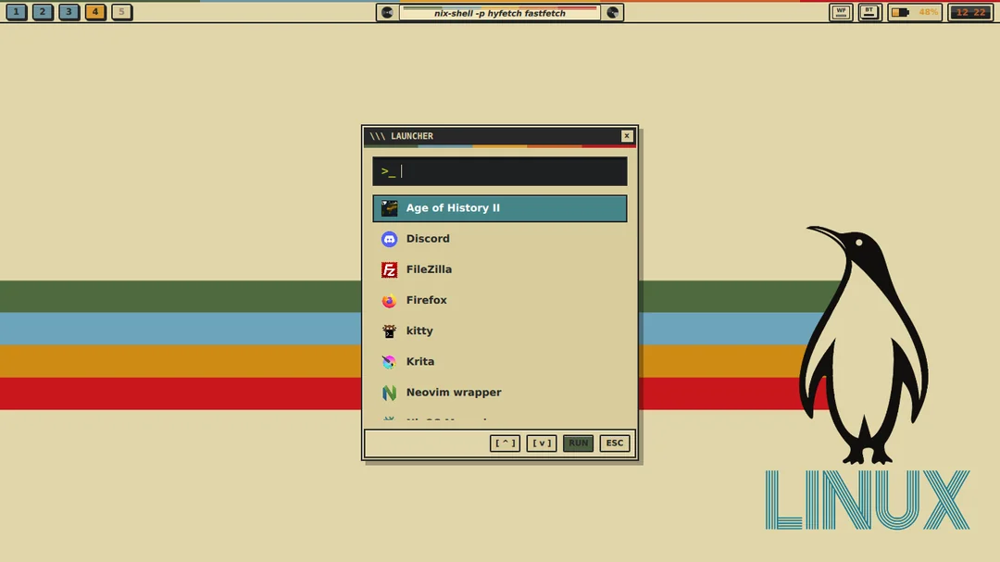
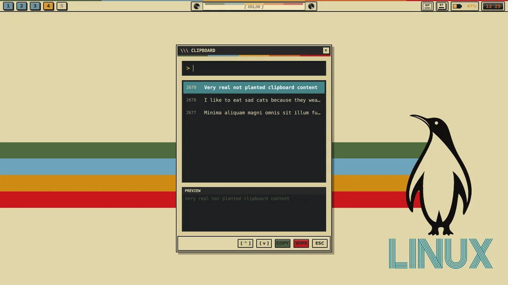

These be my personal nixos configuration files, I didnt test it much so it might break in other systems. <br>
Btw you probably wanna remove the hardware-configuration.nix file before using it yerself <br>

specs:<br>
Editor: nixvim (neovim)<br>
Browser: firefox<br>
Terminal: Kitty<br>
WM: Hyprland<br>
Bar/Launcher/Clipboard/Notifications = Quickshell<br>

Notes:
rebuilding should now auto-start the bar, Theming is also applied. Tho it only works well with light themes
Notifications are now just a bit broken (improvement)

Useful Binds:
SUPER + T = Terminal <br>
SUPER + A = Launcher <br>
SUPER + V = Clipboard <br>
SUPER + B = Notification history <br>
SUPER + R = Wallpaper manager
SUPER + N = Screenshot (Region) <br>
SUPER + 1-0  = Change workspace <br>
SUPER + HJKL = Change focus <br>

Capslock and Alt's default behavior is disabled by default. <br>
Holding capslock makes the keys `J` and `K` work as left/right mouse buttons, cause its more convenient in a laptop.
Alt is a tad more inconvenient, it changes the behaviour of the following keys: <br>
<ul>K -> L</ul>
<ul>U -> O</ul>
<ul>I -> P</ul>
<ul>M -> . (The full stop key)</ul>
<ul>8 -> 9</ul>
<ul>[ -> '</ul>
This was added because my keyboard broke, whilst it is set to target my keyboard ID, it might still apply to others, I dunno. You will probably want to remove that in configuration.nix in the keyd section, just remove the following line:

```
settings = {
    main = {
    capslock = "layer(mouse)";
    leftalt = "layer(brokey)"; # Remove this line
    };
```

Screenshots:






